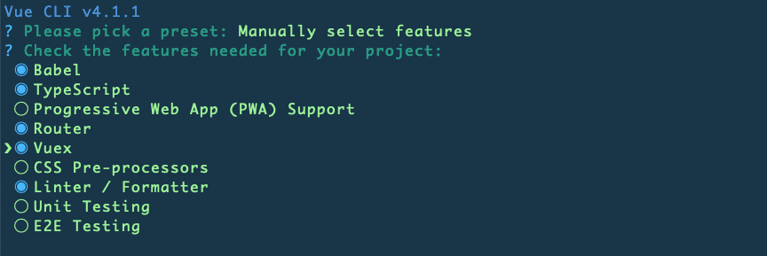
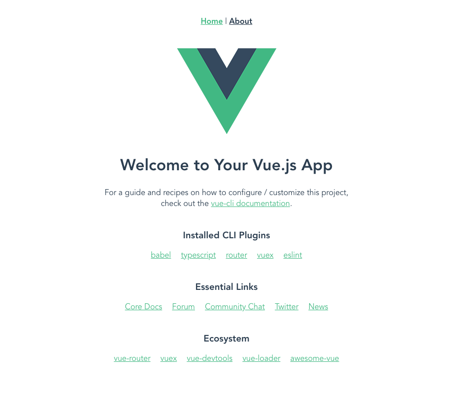
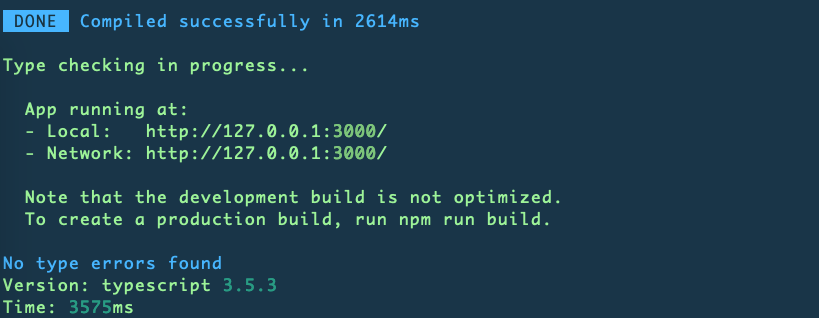

## vue cli 3 + typescript + webpack 项目搭建

### 1、运用官方脚手架搭建

这是官方文档：https://cli.vuejs.org/zh/

#### 全局安装 @vue/cli

```sh
npm install -g @vue/cli
```

#### 运行vue create

```sh
vue create vue-ts-demo
```


default 那一项没有包含typescript，我们选择 Manually select features这一项。

我这里选择了babel，typescript，router，vuex，CSS Pre-processors，Linter / Formatter



然后按照提示选择自己需要安装的，这是我的选择。我没有选择默认的histoty mode for router，习惯了使用hash mode，这些都是可以自由选择的


配置成功之后


把项目跑起来

```sh
$ cd vue-cli3-ts-demo
$ npm run serve
```


项目跑起来是 `npm run serve`，并不是以前的 `npm run dev`，可以看下package.json里面的代码

```json
"scripts": {
    "serve": "vue-cli-service serve",
    "build": "vue-cli-service build",
    "lint": "vue-cli-service lint"
},
```

在浏览器打开地址 "http://localhost:8080/"，可以看到项目已经跑起来了



### 2、typescript

ts的语法及用法，参考官方文档：https://www.tslang.cn/index.html

我之前也写过一些笔记：https://github.com/liujianxi/share/tree/master/ts-notes

### 3、项目结构

```
├── README.md
├── babel.config.js
├── package-lock.json
├── package.json
├── public
│   ├── favicon.ico
│   └── index.html
├── src
│   ├── App.vue
│   ├── assets
│   │   └── logo.png
│   ├── components
│   │   └── HelloWorld.vue
│   ├── main.ts
│   ├── router
│   │   └── index.ts
│   ├── shims-tsx.d.ts
│   ├── shims-vue.d.ts
│   ├── store
│   │   └── index.ts
│   └── views
│       ├── About.vue
│       └── Home.vue
└── tsconfig.json
```

看一下项目结构，可以看到shims-tsx.d.ts和shims-vue.d.ts这两个文件

用处如下

shims-tsx.d.ts：允许在vue项目中使用.tsx文件，详细可参考[此处](https://www.tslang.cn/docs/handbook/jsx.html)

shims-vue.d.ts：允许导入和使用.vue单个文件组件，因为typescript默认并不支持导入vue文件

### 4、webpack配置

从项目结构中可以看到，之前的webpack相关的配置都不见了。

然后 `vue-cli-service` 是个什么东西，[文档](https://cli.vuejs.org/zh/guide/cli-service.html)这么描述的

```sh
vue-cli-service serve 命令会启动一个开发服务器 (基于 webpack-dev-server) 并附带开箱即用的模块热重载 (Hot-Module-Replacement)
```

我们可以看到 `vue-cli-service` 是封装好的，开箱即用的。
可是有时候需要自己配置webpack，[文档](https://cli.vuejs.org/zh/config/)中也有给出方法，就是新建一个vue.config.js文件

```sh
vue.config.js 是一个可选的配置文件，如果项目的 (和 package.json 同级的) 根目录中存在这个文件，那么它会被 @vue/cli-service 自动加载。
```

在package.json同级处新建vue.config.js文件，按照文档，配置如下

```js
// vue.config.js
module.exports = {
  publicPath: process.env.NODE_ENV === 'production'
  ? './'
  : '/',

  outputDir: 'dist',

  assetsDir: 'static',

  filenameHashing: true,

  // eslint-loader 是否在保存的时候检查
  lintOnSave: true,

  // 是否使用包含运行时编译器的Vue核心的构建
  runtimeCompiler: false,

  // 默认情况下 babel-loader 忽略其中的所有文件 node_modules
  transpileDependencies: [],

  // 生产环境 sourceMap
  productionSourceMap: false,

  // cors 相关 https://jakearchibald.com/2017/es-modules-in-browsers/#always-cors
  // corsUseCredentials: false,
  // webpack 配置，键值对象时会合并配置，为方法时会改写配置
  // https://cli.vuejs.org/guide/webpack.html#simple-configuration
  configureWebpack: (config) => {
  },

  // webpack 链接 API，用于生成和修改 webapck 配置
  // https://github.com/mozilla-neutrino/webpack-chain
  chainWebpack: (config) => {
    // 因为是多页面，所以取消 chunks，每个页面只对应一个单独的 JS / CSS
    config.optimization
    .splitChunks({
        cacheGroups: {}
    });

    // 'src/lib' 目录下为外部库文件，不参与 eslint 检测
    config.module
    .rule('eslint')
    .exclude
    .add('/Users/maybexia/Downloads/FE/community_built-in/src/lib')
    .end()
  },

  // 配置高于chainWebpack中关于 css loader 的配置
  css: {
    // 是否开启支持 foo.module.css 样式
    requireModuleExtension: true,

    // 是否使用 css 分离插件 ExtractTextPlugin，采用独立样式文件载入，不采用 <style> 方式内联至 html 文件中
    extract: true,

    // 是否构建样式地图，false 将提高构建速度
    sourceMap: false,

    // css预设器配置项
    loaderOptions: {
      // 给 sass-loader 传递选项
      sass: {
        // @/ 是 src/ 的别名
        // 所以这里假设你有 `src/variables.sass` 这个文件
        // 注意：在 sass-loader v7 中，这个选项名是 "data"
        prependData: `@import "~@/variables.sass"`
      },
      // 默认情况下 `sass` 选项会同时对 `sass` 和 `scss` 语法同时生效
      // 因为 `scss` 语法在内部也是由 sass-loader 处理的
      // 但是在配置 `data` 选项的时候
      // `scss` 语法会要求语句结尾必须有分号，`sass` 则要求必须没有分号
      // 在这种情况下，我们可以使用 `scss` 选项，对 `scss` 语法进行单独配置
      scss: {
      //   prependData: `@import "~@/variables.scss";`
      },
      // 给 less-loader 传递 Less.js 相关选项
      less:{
        // http://lesscss.org/usage/#less-options-strict-units `Global Variables`
        // `primary` is global variables fields name
        globalVars: {
            primary: '#fff'
        }
      }
    }
  },

  // All options for webpack-dev-server are supported
  // https://webpack.js.org/configuration/dev-server/
  devServer: {
    open: true,

    host: '127.0.0.1',

    port: 3001,

    https: false,

    hotOnly: false,

    proxy: null,

    before: app => {
    }
  },
  // 构建时开启多进程处理 babel 编译
  parallel: require('os').cpus().length > 1,

  // https://github.com/vuejs/vue-cli/tree/dev/packages/%40vue/cli-plugin-pwa
  pwa: {},

  // 第三方插件配置
  pluginOptions: {}
};
```

值得注意的是 从 Vue CLI 3.3 起已弃用 `baseUrl`，推荐使用 `publicPath`。

配置好之后运行 `npm run serve` 可以看到运行成功，刚配置的host、port已经生效，其他的配置可以自己慢慢添加



项目打包运行 `npm run build` 也是ok的


### 5、项目中的ts用法

项目已经搭建完毕，看一下里面的ts用法

```html
<!-- src/components/HelloWorld.vue -->
<template>
  <div class="hello">
    <h1>{{ msg }}</h1>
  </div>
  ...
</template>
<script lang="ts">
import { Component, Prop, Vue } from 'vue-property-decorator';

@Component
export default class HelloWorld extends Vue {
  @Prop() private msg!: string; //非空断言
}
</script>
<style scoped>
</style>
```

`vue-property-decorator`是什么呢，文档[在这](https://github.com/kaorun343/vue-property-decorator)，它提供了函数<strong> 装饰器修饰符 </strong>语法

从官方文档中可看到

```js
import { Vue, Component, Prop } from 'vue-property-decorator'

@Component
export default class YourComponent extends Vue {
  @Prop(Number) readonly propA: number | undefined
  @Prop({ default: 'default value' }) readonly propB!: string
  @Prop([String, Boolean]) readonly propC: string | boolean | undefined
}
```

相当于

```js
export default {
  props: {
    propA: {
      type: Number
    },
    propB: {
      default: 'default value'
    },
    propC: {
      type: [String, Boolean]
    }
  }
}
```

那么`src/components/HelloWorld.vue` 就相当于

```html
<template>
  <div class="hello">
      <h1>{{ msg }}</h1>
  </div>
  ...
</template>
<script lang="ts">
export default {
  props: {
    msg: {
      type: String
    }
  }
}
</script>
<style scoped>
</style>
```

以上